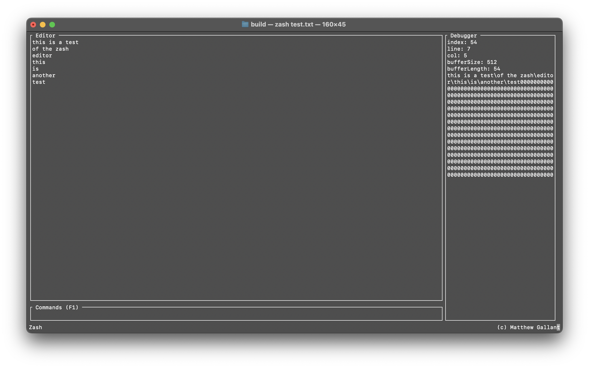

# Zash

A wicked fast command-line text editor written in pure C.



## Dependencies

### macOS

```bash
brew install cmake ncurses
```

### Ubuntu/Debian Linux

```bash
sudo apt install cmake ncurses
```

### Fedora/Red Hat Linux

```bash
sudo dnf install cmake ncurses
```

## Installing

```bash
mkdir build
cd build
cmake ..
make install
```

## Running

```bash
zash /path/to/my/file.txt
```

## To Do

- Handle character deletions correctly
- Handle character insertions correctly
- Add status area
- Make main loop more efficient
- Scroll lines if window length exceeded
- Scroll columns if window width exceeded
